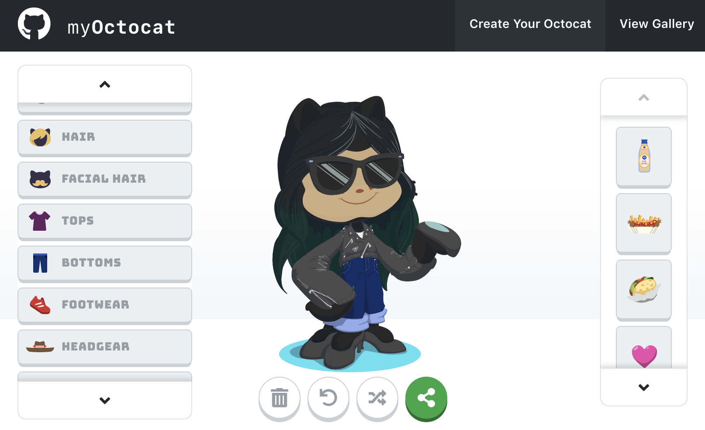

# Welcome to GitHub

Welcome to GitHub—where millions of developers work together on software. Ready to get started? Let’s learn how this all works by building and publishing your first GitHub Pages website!

## Repositories

Right now, we’re in your first GitHub **repository**. A repository is like a folder or storage space for your project. Your project's repository contains all its files such as code, documentation, images, and more. It also tracks every change that you—or your collaborators—make to each file, so you can always go back to previous versions of your project if you make any mistakes.

This repository contains three important files: The HTML code for your first website on GitHub, the CSS stylesheet that decorates your website with colors and fonts, and the **README** file. It also contains an image folder, with one image file.

## Describe your project

You are currently viewing your project's **README** file. **_README_** files are like cover pages or elevator pitches for your project. They are written in plain text or [Markdown language](https://guides.github.com/features/mastering-markdown/), and usually include a paragraph describing the project, directions on how to use it, who authored it, and more.

Hello World! I’m Alberto Fernandes. This is my hello-world exercise
  
Once you click `Commit changes`, your changes will automatically be published on your GitHub Pages website. Refresh the page to see your new changes live in action.

:tada: You just made your first commit! :tada:

## Extra Credit: Keep on building!

Change the placeholder Octocat gif on your GitHub Pages website by [creating your own personal Octocat emoji](https://myoctocat.com/build-your-octocat/) or [choose a different Octocat gif from our logo library here](https://octodex.github.com/). Add that image to line 12 of your `index.html` file, in place of the `<img src=` link.

Want to add even more code and fun styles to your GitHub Pages website? [Follow these instructions](https://github.com/github/personal-website) to build a fully-fledged static website.

## Everything you need to know about GitHub

Getting started is the hardest part. If there’s anything you’d like to know as you get started with GitHub, try searching [GitHub Help](https://help.github.com). Our documentation has tutorials on everything from changing your repository settings to configuring GitHub from your command line.
